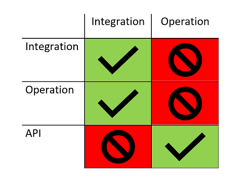
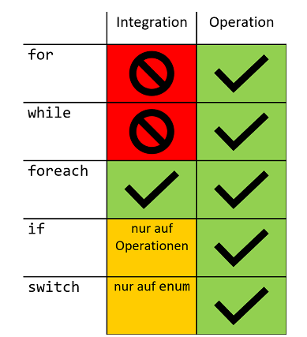

# IospAnalyzer
Dieser Roslyn Analyzer für C#, hilft bei der Einheitung des Integration Operation Segregation Principles.

## Motivation
Seit nunmehr 12 von insgesamt 20 Jahren Programmiererfahrung, studiere ich die Clean Code Prinzipien. In den letzten 3 Jahren hat sich meine Codequalität, durch die Beachtung des Iosps, nochmal deutlich verbessert.

In letzter Zeit habe ich versucht Junior Entwickler an Clean Code Prinzipien heranzuführen. Es herrscht zwar breite Akzeptanz für dieses Prinzip, mitunter war es aber sehr schwierig, dies in der Praxis umzusetzen. Auch als erfahrener Clean Coder, bricht unter dem Projektdruck, die Konzentration und Disziplin zusammen, sich immer an das Iosp zu halten. Dies fällt hinterher beim Code Review auf und braucht Zeit, um diese Schuld auszuglelichen. 

Also am Besten gleich richtig machen - beim Code schreiben!

Dafür habe ich diesen C# Analyser geschrieben, der auf die Regeln des Iosps achtet und einem bei Nichteinhaltung auf die Finger haut. ;-)

## Was ist das Iosp?
Iosp steht für **I**ntegration **O**peration **S**egregation **P**rinciple.

Dieses wurde von den deutschen Clean Coder Stefan Lieser und Ralf Westphal erfunden. https://ccd-school.de/ . Eine Aufzeichnung eines Webniars zu Iosp gibt es hier: https://youtu.be/Ihl3mcM1xhY

Es ist eine Erweiterung des Single Responsibility Principle (SRP). Dabei geht man davon aus, dass Code auf unterschiedlilchen Abstraktionsebenen geschrieben wird, d.h. unterschiedliche Verantwortlichkeiten hat. Entweder man schreibt Algorithmen und Domänenlogik (Businesslogik), dann geschieht das auf einer anderen Ebene, als Code der die Units integriert und zusammenspielen zu lassen.

Leider ermöglichen es uns die gängigen General Puropose Programmiersprachen wie C#, Abstraktionslevel munter zu vermischen.

Das Iosp unterscheidet bei Funktionen/Methoden zwischen zwei Verantwortlichkeiten
- Integrations-Methoden
  - haben keine (wenig) Logik, und integrieren die Operationen
- Operations-Methoden
  - enthalten die Domänenlogik
  - arbeiten nach dem EVA Prinzip

### Zweck - Abhängikeiten auflösen
Iosp ist kein Selbstzweck! Zwischen diesen zwei Verantwortlichkeien von Methoden zu unterscheiden, löst Abhängigkeiten unter Funktionseinheiten auf und macht den Code super einfach zu testen.

- Integrations-Methoden
  - haben maximale Abhängigkeiten
- Operations-Methoden
  - haben 0 Abhängigkeiten
  - arbeiten nach dem EVA Prinzip

### Testbarkeit
- Integration-Methoden
  - werden durch Integrationstest getestet
  - es reichen wenige Tests aus
  - Echte Abhängigkeiten keine Mocks!

- Operations-Methoden
  - werden durch Unittests getestet
  - Logik wird umfassend abgedeckt
  - Keine Abhängigkeiten - keine Mocks notwendig

## Iosp Regeln
Wer Iosp anwenden möchte, muss diese Regeln einhalten

### Aufruf Regeln - Wer darf WEN aufrufen?



### Code Regeln - Wer darf WAS aufrufen?


# Verwendung des IospAnalyzers
1. Einbindung des Nuget-Package IospAnalyzer
2. Annotation der Methoden

- Integrations-Methoden werden mit dem Attribut `[Integration]` gekennzeichnet
- Operations-Methoden werden mit dem Attribut `[Operation]` gekennzeichnet
- Api-Methoden werden nicht gekennzeichnet, oder kommen aus dem Framework, Bibliotheken etc.

Der Analyzer wird von der C# Compilere Infrastruktur automatisch berücksichtigt. Er erscheinen in der Entwicklungsumgebung (VisualStudio, VS Code, Raider) entsprechende Fehlermeldungen.

```csharp
[Integration]
public void Integration()
{
    Integration2();
    Operation();
    Api();
}

[Integration]
public void Integration()
{   
}

[Operation]
public void Operation()
{   
}

public void Api()
{
}
```

# Ausblick
Dieser Analyzer befindet sich Stand September 2020 in der Erprobungsphase.

Sollte sich dieser Ansatz bewähren, werden weitere Regeln zum Analyzer hinzugefügt.